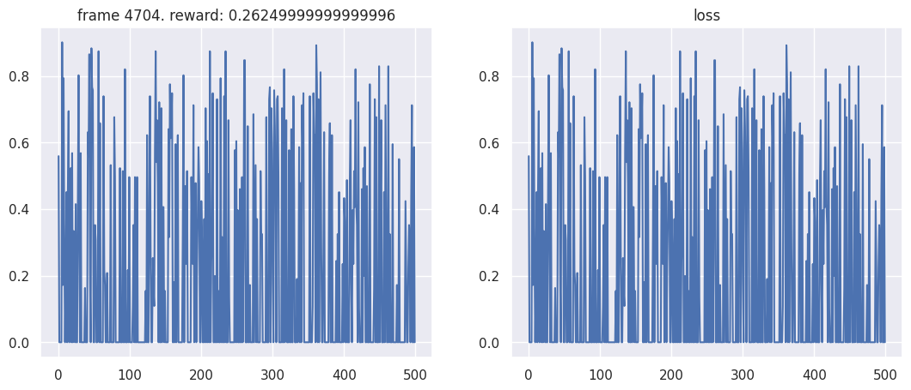

# Deep Reinforcement Learning Lab

## Author
Abubakar Aliyu BADAWI

## University
University of Toulon

## Supervisor
Prof. J. Arjona-Medina

## Overview
This project explores advanced techniques in deep reinforcement learning, including Imitation Learning, Deep Q-Networks (DQN), and Proximal Policy Optimization (PPO). The objective is to implement these techniques, test different architectures, tweak hyperparameters, and evaluate their performance on various tasks and environments.

## Contents
1. [Imitation Learning](#imitation-learning)
2. [Deep Q-Network](#deep-q-network)
3. [Policy Gradients - PPO](#policy-gradients---ppo)

### Imitation Learning
Exploring machine learning models that mimic expert behavior to perform tasks in a simulated driving environment using CNN and MLP networks.

#### Key Aspects
- **Architectures**: CNN and MLP policy networks.
- **Hyperparameter Tuning**: Effects of batch sizes and training epochs.
- **DAgger**: Enhancing model training using Dataset Aggregation.
- **Performance Evaluation**: Comparing models with and without DAgger.

### Deep Q-Network
Utilizing DQN for solving control tasks in different settings: MiniGrid and Pong environments.

#### Key Aspects
- **Architectures**: Testing MLP and CNN in MiniGrid.
- **Hyperparameter Tuning**: Modifying epochs and learning rates to observe changes in performance.
- **Pong Environment**: Challenges due to GPU limitations and adjustments in training episodes.

### Policy Gradients - PPO
Focusing on the PPO algorithm to refine the policy gradient approach, aiming to improve training stability and efficiency in a simulated BipedalWalker-v3 environment.

#### Key Aspects
- **Hyperparameter Tuning**: Varying the number of episodes and weight decay parameters.
- **Performance Metrics**: Observing the impact of changes on rewards, episode lengths, and entropy.

## Results

This repository contains the implementation and results of various deep reinforcement learning algorithms, including Imitation Learning, Deep Q-Networks (DQN), and Proximal Policy Optimization (PPO). The main focus of these experiments was to explore the effects of different architectures and hyperparameter settings on the performance of models in simulated environments.

## Project Structure

- `report.pdf`: A comprehensive report detailing the methodology, experiments, and findings.
- `code/`: Directory containing the source code used for all experiments.
- `Images/`: Contains all the plots generated during the experiments.

## Viewing the Plots

The plots are stored in the `Images` folder and are referenced in the report. Here is how you can view them directly from GitHub:

### Imitation Learning

- 
- 
- 
- 
- 

### Deep Q-Networks (DQN)

- 
- 
- 
- 
- 
- 

### Proximal Policy Optimization (PPO)

- 
- 
- 

## Setup and Running Instructions

- Ensure you have Python 3.x installed.
- Install the necessary dependencies as listed in `requirements.txt`.
- Run the scripts in the `code/` directory to reproduce the experiments.

## Contributing

Feel free to fork this repository and submit pull requests to contribute to this project. You can also open an issue if you find any bugs or have suggestions for additional experiments.

## License

This project is open-sourced under the MIT license. See the LICENSE file for more details.

## Conclusion
The project highlights the significance of architecture selection and hyperparameter tuning in deep reinforcement learning. Each technique and modification provided valuable lessons on the models' behavior and performance in complex environments.

## Acknowledgements
Special thanks to Prof. J. Arjona-Medina and the University of Toulon for guidance and resources throughout this research.
